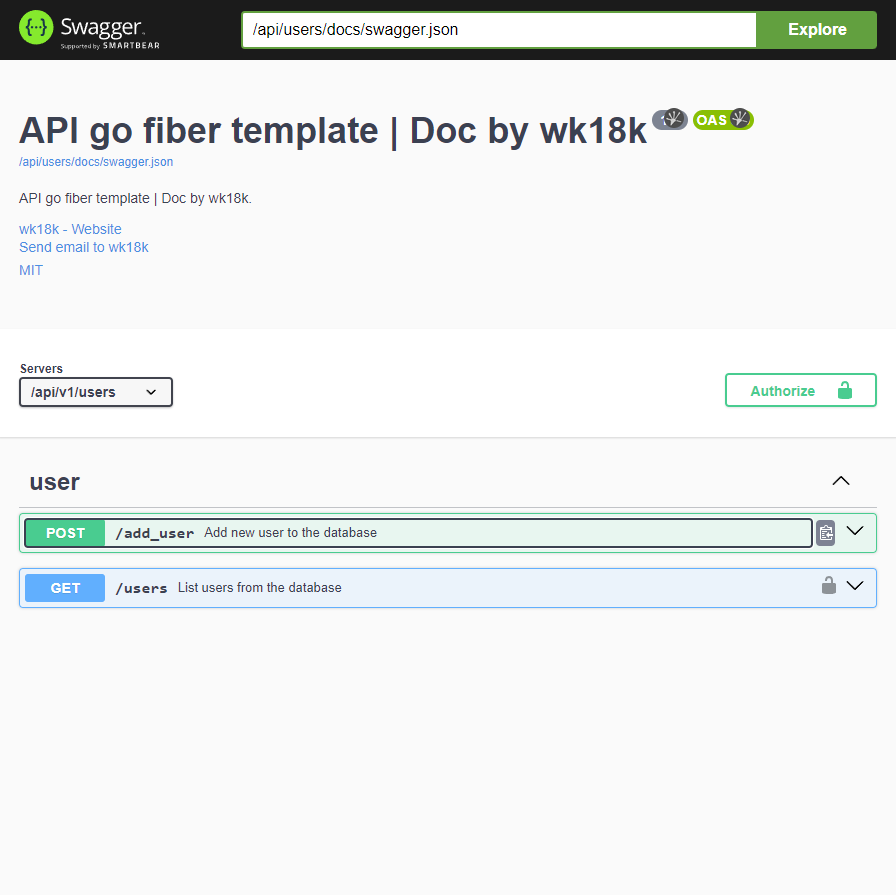

<div align="center">

# go-fiber-swagger



</div>

## Install golang package

```bash
go mod tidy
```

# Start APP

```sh
go run . || go run main.go
```

## Air

```sh
go install github.com/cosmtrek/air@latest
```

```sh
air
```

# Podman

```
podman build -t fiber-test .
```

```
podman run --rm -it -p 3000:3000 fiber-test
```

# Swagger
- can edit in [docs/swagger.json](docs/swagger.json)